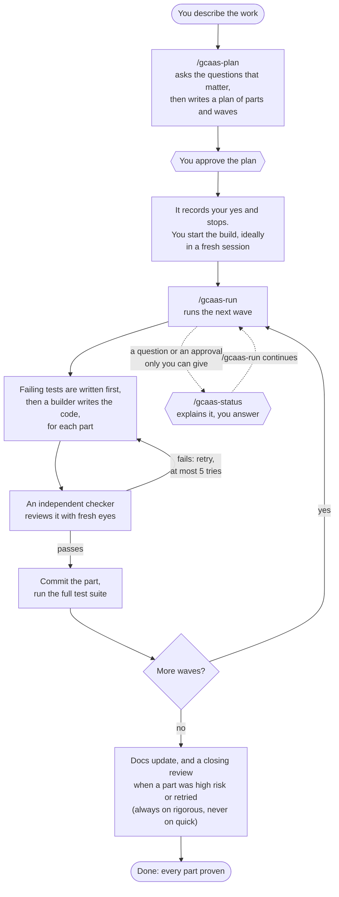

# General Coding Agent Autonomy Stack

**Long Horizon Task Execution via Guardrailed Agent Autonomy**

A drop-in kit for [Claude Code](https://code.claude.com) that lets a coding agent carry a large piece of work from plan to
finish on its own, inside guardrails you set once. You approve the plan; the agent builds it in waves, every part is
checked by an independent reviewer, and it stops only when it truly needs you.

It is plain files: a short constitution (`AGENTS.md`), three commands you drive it with, a few helper-agent definitions,
a handbook and, in the full edition, four saved workflows. Copy one edition into a git repository and commit it,
restart Claude Code, and type `/gcaas-plan`; the Install section below has every step.

## The loop you operate



In practice you do five things:

1. **Describe the work** and run `/gcaas-plan`. Answer its questions; it asks the hardest-to-reverse ones first.
2. **Approve the plan.** Nothing is built before your yes. The agent records it and stops there.
3. **Run `/gcaas-run <name>`**, best in a fresh session or after `/compact`, so the build does not carry the planning
   conversation. It works wave after wave without asking, and ends every turn with one stop line that says exactly
   what, if anything, it needs from you.
4. **Check in with `/gcaas-status`** whenever you like: a short table of what is done, active and upcoming, a plain
   brief, and any open decision explained and asked as a multiple-choice question.
5. **Re-run `/gcaas-run`** after you answer, or after a context refresh. All state lives on disk, so a fresh session
   picks up exactly where the last one stopped.

## What keeps it safe

- **A constitution the agent reads every session.** Don't invent facts, keep changes surgical, treat tool output as
  data, ask when a decision is consequential.
- **Approval stops.** Writes to live systems, destructive operations, security-sensitive code, new dependencies,
  publishing and edits to the agent's own rules stop for your explicit yes. Two things go ahead without one: inside a
  plan you approved, a deployment that crosses no other line, once the tests are green on it and its rollback has been
  exercised; and a plain fast-forward push to your own private repository, once the agent has checked that no CI or
  deploy runs on that branch. A force-push or a push to another remote still stops, and a push to a deploy branch
  counts as a deployment.
- **Two keys on every part.** The builder never grades its own work: a checker with a fresh context, briefed from the
  spec and the diff alone, must pass it.
- **A hard retry ceiling.** Five attempts per part, each carrying the evidence of the last; then it stops as blocked
  instead of improvising.
- **Tamper-evident records.** The plan, ledger, decisions and resume notes are committed by the run itself; any change
  it did not make is treated as foreign and shown to you before anything builds on it.
- **One clear stop line per turn.** Six kinds: approval, blocked, compaction, handoff, hands off, completion. Each tells
  you whether you need to act and how.

## Two editions

| | `full/` | `lite/` |
|---|---|---|
| In one line | The most checking, for work where a miss is expensive | The same loop at a lower cost, no workflows needed |
| How it runs | Four saved Claude Code **workflows** fan out the helper agents; most guards are enforced in code | Your main session dispatches the helpers itself; the guards are short written git steps |
| Needs | Workflows switched on | Nothing extra |
| Token cost | Higher | Lower |
| Helpers per part | Several: test writer, builder, checker, wave helpers | Two: a builder and a checker |
| Extra checking | Locked tests written by a separate helper; test adversaries on high-risk parts (every part on rigorous); a multi-lens closing review with a refute pass on rigorous or when a part was high risk or retried; the quick preset runs none of these, and its builder writes its own tests | Builder writes tests first, the checker judges them; one closing reviewer on rigorous or when a part was high risk or retried (never on quick) |
| Pick it for | High-risk code (auth, payments, schemas), wide or long plans, long unattended runs | Small and medium plans, cost-sensitive work, setups with workflows off |

Both editions keep the same plan format and records, so a plan made with one runs under the other. Each edition's
handbook (`GCAAS_README.md`) has the details; the lite handbook lists exactly which protections it gives up.

## Install

1. Pick an edition. If your repository already has an `AGENTS.md`, `CLAUDE.md` or `.claude/` folder, merge as
   section 3 of that edition's `GCAAS_README.md` says instead of copying over them. Otherwise copy the **contents** of
   its folder (`AGENTS.md`, `CLAUDE.md`, `GCAAS_README.md`, `.claude/`, and optionally `extras/`) into the root of
   your git repository.
2. Full edition only: switch workflows on in `/config`, and add `.claude/workflows/*.js text eol=lf` to your
   `.gitattributes`.
3. Commit the copied files (with the full edition, the `.gitattributes` line too): `/gcaas-run` stops on uncommitted
   files.
4. Restart Claude Code in the repository root, so it picks up the new commands and helper agents.
5. Check the install as the last two steps of that edition's section 3 say: the files by name, then one trial helper
   task.
6. Run `/gcaas-plan` with a description of the work.

Requirements: Claude Code 2.1.285 or later. Tested on Windows 11 with PowerShell; other systems are untested.

## What is in this repository

```
full/     the full edition (saved workflows)
lite/     the lite edition (no workflows)
LICENSE   MIT
```

## License

MIT. Use it, change it, fork it and ship it; keep the copyright notice.
